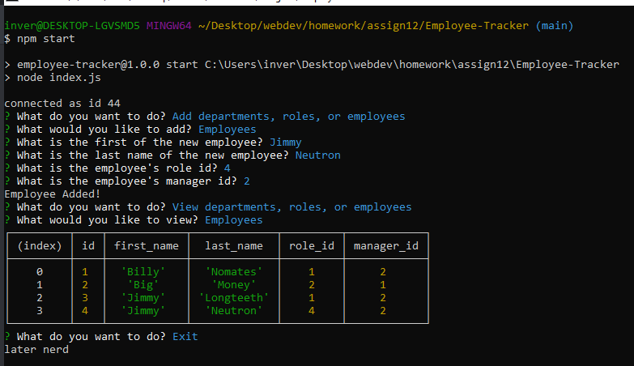

# Employee-Tracker

## Description

A basic content managment system that allows a user to view tables containing data from different mysql tables as well as add new table rows.

## Table of Contents
If your README is long, add a table of contents to make it easy for users to find what they need.
- [Installation](#installation)
- [Usage](#usage)
- [License](#license)

## Installation

- Run the commands contained in the setup and seed schemas saved in the db folder to set up the database.
- Run an npm install command in the terminal to make sure the correct packages are installed.
- npm start the program after setting up a .env file that contains user and db info for connection to work.

## Usage

- Select options from the menu in the terminal.
- View allows the user to view either employees, roles, or departments and then returns to the start screen.
- Add allows the user to add either employees, roles, or departments and then returns to the start screen. Viewing the data after this reflects changes just made.
- Update employee is currently not working.

:    

## License

Copyright 2021 Sean Kelly

Permission is hereby granted, free of charge, to any person obtaining a copy of this software and associated documentation files (the "Software"), to deal in the Software without restriction, including without limitation the rights to use, copy, modify, merge, publish, distribute, sublicense, and/or sell copies of the Software, and to permit persons to whom the Software is furnished to do so, subject to the following conditions:

The above copyright notice and this permission notice shall be included in all copies or substantial portions of the Software.

THE SOFTWARE IS PROVIDED "AS IS", WITHOUT WARRANTY OF ANY KIND, EXPRESS OR IMPLIED, INCLUDING BUT NOT LIMITED TO THE WARRANTIES OF MERCHANTABILITY, FITNESS FOR A PARTICULAR PURPOSE AND NONINFRINGEMENT. IN NO EVENT SHALL THE AUTHORS OR COPYRIGHT HOLDERS BE LIABLE FOR ANY CLAIM, DAMAGES OR OTHER LIABILITY, WHETHER IN AN ACTION OF CONTRACT, TORT OR OTHERWISE, ARISING FROM, OUT OF OR IN CONNECTION WITH THE SOFTWARE OR THE USE OR OTHER DEALINGS IN THE SOFTWARE.

